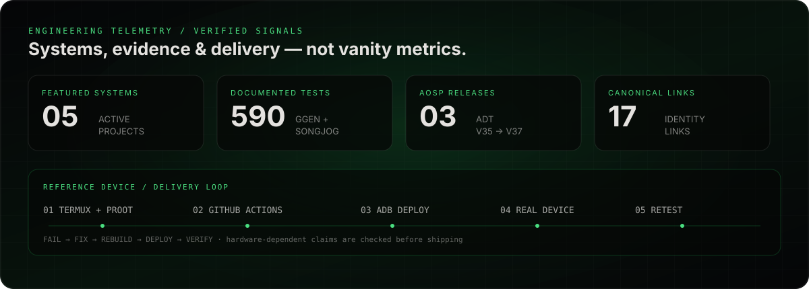
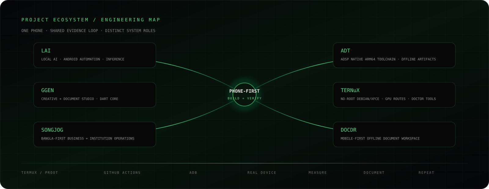

  

# Sobuj Miah

**Independent Software & AI Systems Engineer**  
On-Device AI · Android · ARM64 Linux · Native Tooling · Software Systems

I build systems close to the hardware: local LLM inference on ARM devices, consent-bound Android automation, native toolchains compiled from AOSP source, and Linux desktops running on phones. Self-taught, and built entirely from an Android phone (Termux / PRoot Debian, no PC) — heavy compilation routes through GitHub Actions, and every hardware-dependent claim is checked against one physical reference device before I call it done.

  

## What I Build

- **On-device AI runtimes** — llama.cpp-based local inference on ARM64 Android: GGUF models, streaming, KV-prefix reuse, model-integrity verification, CPU/GPU backend routing
- **Consent-driven Android automation** — Accessibility and Shizuku privileged execution behind explicit user consent, with a hash-chained audit trail
- **Native ARM64 toolchains** — Android SDK build-tools and platform-tools built from AOSP source for Linux ARM64/glibc, shipped as SHA-256-verified offline artifacts
- **Linux on Android** — no-root Debian/Xfce desktops with real GPU routes (Zink/Turnip Vulkan, VirGL) and doctor/repair/benchmark tooling
- **Bangla-first applications** — business ledger and document tools where Bengali is the primary language, not a translation layer

## Services

&nbsp;&nbsp;&nbsp; 
&nbsp;&nbsp;&nbsp;

Practical technology and digital support for individuals, offices, and businesses — with the full service catalog available on the [Services page](https://soobujmiah.github.io/services/).

## Featured Work

| Project | What it is | Engineering evidence |
|---|---|---|
| [LAI](https://github.com/soobujmiah/lai)    | Bangla-first local AI + consent-driven Android automation runtime | Real arm64 llama.cpp CPU inference (GGUF, streaming, KV-prefix reuse) with device-measured throughput and TTFT; Shizuku/Accessibility consent boundaries with a hash-chained audit trail; symbolized root-cause diagnosis of an Adreno Vulkan driver crash (`vkCmdBindPipeline` SIGSEGV) that shaped a fail-closed CPU-default architecture · [v0.9.7](https://github.com/soobujmiah/lai/releases) |
| [GGEN](https://github.com/soobujmiah/ggen)    | Android-first creative & document studio (Flutter/Dart) | Pure-Dart core with 143 unit tests and a Flutter shell with 353 widget/controller tests; deterministic text-layout engine with a proven conservation invariant; transactional file persistence with SHA-256 receipts |
| [ADT](https://github.com/soobujmiah/adt)    | Native ARM64 Android development toolchain | Builds Android SDK build-tools/platform-tools from AOSP source for Linux ARM64/glibc (not only Android/Bionic); ships SHA-256-verified offline release artifacts; validates the full pipeline on real hardware — native source → APK → sign → install → JNI load → run · [v37.0.0](https://github.com/soobujmiah/adt/releases) |
| [Ternux](https://github.com/soobujmiah/ternux)    | No-root Debian/Xfce Linux desktop on an Android phone | Zink/Turnip Vulkan and VirGL GPU routes; modular Bash installer with doctor/repair/benchmark tooling; glmark2 score 140 (OpenGL 4.6 via Zink) measured on device, with device evidence that separates measured results from untested claims |
| [Songjog](https://github.com/soobujmiah/songjog)    | Bangla-first business & institution operations app | Owner Edition: fast daily entry, local SQLite records, auditable corrections instead of destructive deletes; 94 tests green on CI; export/diagnostics validated on the physical reference device |

## Research & Engineering

Each repository documents what is **implemented and device-verified** separately from what is **experimental** or **planned**. The current boundary:

- **Validated on hardware** — arm64 llama.cpp CPU inference with measured throughput/TTFT; AOSP toolchain builds for ARM64 glibc with verified artifacts; Vulkan desktop rendering on Android via Zink/Turnip with a measured glmark2 score; Bangla text shaping and layout invariants under test
- **Diagnosed, deliberately not shipped** — the Adreno Vulkan crash in LAI's GPU inference path: root-caused with symbols, then gated fail-closed to CPU rather than shipped half-working
- **Experimental / in qualification** — GPU LLM acceleration (Vulkan on Adreno) and Qualcomm Hexagon/QNN NPU paths: treated as qualification gates, not shipped capabilities, until device evidence exists

## Engineering Principles

- **Evidence before claims** — separate implemented, measured, experimental, and planned work.
- **Fail closed** — unsupported or unstable hardware paths stay gated instead of being presented as working.
- **Phone-first is a constraint, not a slogan** — the development loop is designed around one Android device and remote heavy builds.
- **Reproducibility matters** — source, build inputs, checksums, tests, and release artifacts should be traceable.
- **Consent and auditability** — privileged Android automation is explicit, bounded, and logged.
- **Offline resilience** — important workflows and artifacts should remain useful without a permanent network dependency.

## Project Ecosystem

  

The projects are separate systems with complementary roles: **LAI** focuses on local AI and Android automation; **ADT** provides native ARM64 development tooling; **Ternux** provides the Linux-on-Android environment; **GGEN** and **Songjog** turn the platform into user-facing applications; **DocDr** explores an offline document workspace. The common thread is the same build → deploy → measure → document loop.

## Tech Stack

   
   
   
   
   
   
   
  

## How I Work

Only the heavy build runs remotely, on GitHub Actions. Everything else — writing and editing code, pulling the built artifact back, installing it over ADB, launching it, debugging what goes wrong — happens on the same phone against the same physical reference device. Failures loop straight back into a fix → rebuild → redeploy → retest pass. No separate build machine, test lab, or handoff between roles.

## Currently

Qualifying GPU/NPU acceleration paths (Vulkan on Adreno, Hexagon/QNN) against real hardware, hardening CI/release pipelines across these projects, and building [DocDr](https://github.com/soobujmiah/docdr) — a mobile-first offline document workspace, early development.

## Find Me Online

&nbsp;&nbsp; 
&nbsp;&nbsp; 
&nbsp;&nbsp; 
&nbsp;&nbsp; 
&nbsp;&nbsp; 
&nbsp;

---

More detail — bilingual (বাংলা/English), with an evidence-graded claims model and a per-claim verification log: **[soobujmiah.github.io](https://soobujmiah.github.io)**
